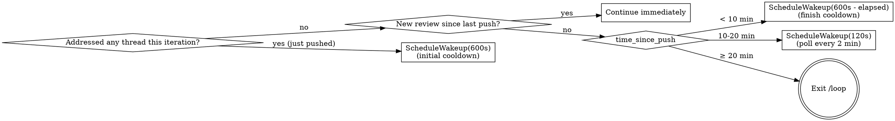

# Babysit PR

## Overview

One pass: enumerate unresolved review threads on the current branch's PR, address each (apply a fix or reply with reasoning), commit + push, then resolve. Designed to run repeatedly under `/loop` so the cadence absorbs new reviews.

**The "resolved" state on a review thread is GraphQL-only.** `gh pr view`, REST `/pulls/{n}/comments`, and the GitHub web search all hide it. Every thread read and write below uses `gh api graphql`. If you find yourself in `gh pr view` output, you're in the wrong API.

## How to invoke

```
/loop /babysit-pr
```

No interval — let the model self-pace via `ScheduleWakeup` so it can wait for a fresh review between iterations.

## When NOT to use

- Branch has no open PR — skill exits immediately
- Branch is `main` / `master` — skill aborts (this would never have a PR to babysit, but check)
- Uncommitted work in the tree — the skill *will* commit and push, surface the dirty state to the user first
- Reviewer comments require domain judgment the agent can't make (security policy, business logic) — process the mechanical ones, skip these, do not resolve them

## One iteration

### 1. Identify the PR

```bash
gh pr view --json number,url,headRefName,baseRefName,headRepositoryOwner,headRepository \
  --jq '{num:.number, url:.url, head:.headRefName, base:.baseRefName,
         owner:.headRepositoryOwner.login, repo:.headRepository.name}'
```

If `head` is `main`/`master`, abort. Cache `{owner, repo, num}` for the rest of the iteration.

### 2. List unresolved threads AND scan recent review bodies (GraphQL)

```bash
gh api graphql -f query='
query($owner:String!,$repo:String!,$num:Int!){
  repository(owner:$owner,name:$repo){
    pullRequest(number:$num){
      reviewThreads(first:100){
        nodes{
          id isResolved isOutdated
          comments(first:50){nodes{
            databaseId author{login __typename} body path line diffHunk createdAt
          }}
        }
      }
    }
  }
}' -f owner="$OWNER" -f repo="$REPO" -F num="$NUM"
```

Filter to threads where `isResolved == false && comments.nodes != []`. **Include `isOutdated == true` threads** — they're often outdated *because* a later commit (often yours) already addressed them and they still deserve a reply pointing at the fix plus a resolve. Don't drop them silently.

The first comment's `author.login` + `__typename == "Bot"` tells you who started the thread.

**Then scan recent review *bodies* too.** Codex (and similar reviewers) sometimes post substantive P1/P2 findings only in the review body with a permalink to a file/line — *no* inline thread is created. The reviewThreads query above will not see those, so a body-only finding will look like a "clean" review unless you read it explicitly.

```bash
gh api repos/$OWNER/$REPO/pulls/$NUM/reviews \
  --jq 'map(select(.submitted_at > "'$LAST_PUSH_AT'")) |
        map({user:.user.login, submitted:.submitted_at, body:.body})'
```

For every review submitted after `last_push_at`, read its `body`. Treat any body that contains a `P1 Badge` / `P2 Badge` / `P3 Badge` block (or any other reviewer-specific severity marker) as actionable, even when no thread is attached. A truly clean review has either an empty body or just a 👍.

**Body-only findings can't be resolved via `resolveReviewThread`** — there's no thread id. After fixing them, just reference the issue in the commit message and move on; the review submission stays in the sidebar but no further mutation is needed.

### 3. Plan actions — DO NOT execute yet

Read each thread's file to get current state, then build a working list — one row per thread. For outdated threads, the `line` number is stale, so search the current file for what the comment refers to (it may have moved, been fixed by a later commit, or no longer apply).

| thread_id | action | reply? | resolve? | reply_text |
|---|---|---|---|---|
| `T_abc` | apply fix | **no** | yes | *(none)* |
| `T_def` | disagree / already handled | yes | yes | `Not making this change because …` |
| `T_ghi` | clarify | yes | **no** | `Can you clarify …?` |
| `T_jkl` | skip (policy) | **no** | **no** | *(none)* |

Decision rules:

| Situation | Action | Reply? | Resolve? |
|---|---|---|---|
| Suggestion is correct + actionable | Apply the fix | **no** | yes |
| Suggestion is wrong, low-value, or already addressed (including outdated-because-fixed) | Reply with reasoning or pointing at the fix SHA | yes | yes |
| Comment needs clarification (ambiguous, missing context) | Reply asking a specific question | yes | **no** |
| Comment requires architectural/policy/security judgment | Skip entirely | **no** | **no** |

**When action is taken (code fix applied), no reply is needed — just resolve.** Replies are only for threads where no code change is made.

Treat human reviewer threads the same as bot threads, but raise the bar for "apply without asking": apply only if the change is mechanical or clearly correct. When in doubt, reply asking and leave unresolved.

**Do not post any replies or call any mutations during this step.** Just decide and record. Execution happens in steps 4 and 5 after the push, so every reply references a real SHA.

### 4. Apply fixes and push

Apply every code fix from the working list. If there are no code fixes (only reply-only rows), skip the commit but still continue to step 5.

When there are fixes to commit: follow the repo's commit conventions — check `CLAUDE.md` / `AGENTS.md` / recent `git log` first. Many repos require ticket-ID suffixes (e.g. `(CON-1234)`); reuse the ID from the PR title or current branch's first commit.

```bash
git add -A && git commit -m "<message following repo convention>" && git push
NEW_SHA=$(git rev-parse --short HEAD)
```

If there were no code fixes, capture HEAD anyway for the reply text:

```bash
NEW_SHA=$(git rev-parse --short HEAD)
```

**Never** force-push, rebase, or amend during a babysit loop — review threads anchor to specific commits and these rewrite history.

### 5. Reply and/or resolve — MANDATORY, do not skip

**This step is required even if you made no code changes this iteration.** Work through every row in the working list.

For rows where `reply? == yes` — post the reply first:

```bash
gh api graphql -f query='
mutation($id:ID!,$body:String!){
  addPullRequestReviewThreadReply(input:{pullRequestReviewThreadId:$id, body:$body}){
    comment{id}
  }
}' -f id="$THREAD_ID" -f body="$REPLY_TEXT"
```

For rows where `resolve? == yes` — resolve the thread (reply is not required first for fix rows):

```bash
gh api graphql -f query='
mutation($id:ID!){
  resolveReviewThread(input:{threadId:$id}){thread{id isResolved}}
}' -f id="$THREAD_ID"
```

**Checklist before moving to step 6:**
- [ ] Every "apply fix" row: resolved, no reply
- [ ] Every "disagree / already handled" row: replied + resolved
- [ ] Every "clarify" row: replied, NOT resolved
- [ ] Every "skip" row: no reply, no resolve

**Only after this checklist is complete** do you proceed to step 6.

### 6. Decide whether to continue

The cadence has three phases keyed off `last_push_at = git log -1 --format=%cI HEAD`:

| Phase | Window | Next wakeup |
|---|---|---|
| **Just pushed / addressed threads** | iteration applied a fix | `ScheduleWakeup(600s)` — begin the 10-min cooldown |
| **Cooldown** | `0 < time_since_push < 600s` | `ScheduleWakeup(600s - time_since_push)` — finish the 10-min cooldown in one shot |
| **Poll window** | `600s ≤ time_since_push < 1200s` | `ScheduleWakeup(120s)` — poll every 2 min |
| **Cap reached** | `time_since_push ≥ 1200s` | omit `ScheduleWakeup` → exit `/loop` |

At any point, if a new review is detected, jump back to "Continue immediately" and skip scheduling.



Check for new reviews:

```bash
gh api repos/$OWNER/$REPO/pulls/$NUM/reviews \
  --jq 'map({user:.user.login, submitted:.submitted_at, state:.state, body:.body}) |
        sort_by(.submitted) | reverse | .[0:5]'
```

If the newest review's `submitted_at` is after `last_push_at`, a new review arrived — process it. **Inspect its `body` even when no thread is attached** (see step 2); a body containing a P-badge block is a real finding that needs the same triage as an inline thread.

Under `/loop` dynamic mode: scheduling wakeup = continue, omitting it = exit. State a one-sentence reason in `ScheduleWakeup.reason` reflecting the phase (e.g. `"10-min cooldown after pushing abc1234"`, `"poll 2/5 in 10-20min window"`, `"20-min cap reached, exiting"`).

**Cache-window note.** The 600s cooldown crosses the 5-min prompt-cache TTL (one cache miss — expected, you're idle anyway). The 120s polls stay inside it, so each poll is cheap.

## Reply phrasing

Keep replies to one or two sentences. Replies are only posted when no code fix was applied.

| Outcome | Template |
|---|---|
| Disagree | `Not making this change because {one-line reason}.` |
| Out of scope | `Out of scope for this PR; tracked separately.` |
| Already handled | `Already handled at {file}:{line}.` |
| Need clarification (do not resolve) | `Can you clarify {specific question}? Want to make sure I understand before changing this.` |

## Anti-loop safeguards

- **Same-thread retry cap.** If the same `thread.id` shows up unresolved across three consecutive iterations after you've replied, stop touching it and surface to the user — you're probably misreading the comment.
- **Reviewer ping-pong.** If a fix generates a *new* comment from the same reviewer about the *same line*, address it once. If the next iteration adds a third comment on that line, stop and escalate.
- **Hard ceiling.** Eight iterations without convergence → exit and report.

## Common mistakes

- **Skipping step 5 after a push** — the push is not the end; replies and resolves come after it. Step 5 is mandatory.
- **Posting replies during step 3** — step 3 is planning only; replies posted before the push reference a non-existent SHA
- **Treating "no code changes" as "nothing to do"** — reply-only threads still need step 5; skip the commit, not the replies/resolves
- **Replying on fix rows** — when you applied a code fix, just resolve; a reply adds noise with no value
- **Resolving without replying on disagree/handled rows** — those need a reply first to preserve the audit trail
- **Resolving threads you skipped** — never; only resolve what you actually addressed
- **Trusting `line` on outdated threads** — the line number is stale; read the current file before deciding whether the concern still applies or was already addressed by a later commit
- **Ignoring outdated threads** — they still need a reply (pointing at the fix or explaining what changed) and a resolve; don't drop them silently
- **Treating a review with no inline threads as automatically clean** — Codex often posts substantive P1/P2 findings only in the review *body* with a permalink. Always read review bodies submitted after `last_push_at`; trigger on P-badge blocks just like on threads
- **Amending or force-pushing** — review threads anchor to commits; rewriting breaks them
- **Pushing to `main`** — abort if `head == base` or branch is a default branch
- **Resolving before push lands** — push first, then resolve, so the SHA in your reply is real
