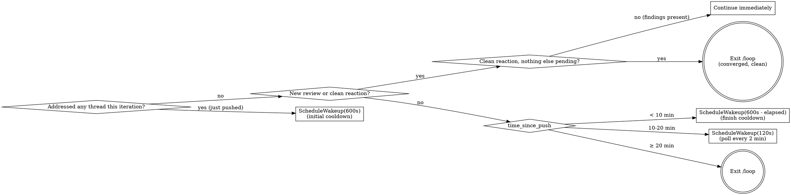

# Babysit PR

## Overview

One pass: enumerate every unaddressed reviewer signal on the current branch's PR — inline **review threads**, body-only **review submissions**, and top-level **issue comments** (e.g. `github-actions[bot]` relaying Codex findings) — address each (apply a fix or reply with reasoning), commit + push, then resolve threads and minimize top-level comments. Designed to run repeatedly under `/loop` so the cadence absorbs new reviews.

**The "resolved" state on a review thread is GraphQL-only.** `gh pr view`, REST `/pulls/{n}/comments`, and the GitHub web search all hide it. Every thread read and write below uses `gh api graphql`. If you find yourself in `gh pr view` output, you're in the wrong API.

**A clean review can be completely silent.** Some Codex configurations signal "reviewed, zero findings" purely by reacting with 👍 on the PR description itself (the issue) — no review submission, no thread, no comment. That looks identical to "no review has run yet" unless you check reactions explicitly (step 2d). Skipping that check is how an already-clean PR gets reported as still waiting. This is most reliably confirmed for a PR's *first* review; GitHub dedupes reactions per user, so it's unconfirmed whether a clean re-review after a later push-fix round re-emits the 👍 with a fresh timestamp or leaves it stuck at the first pass. The gate below only ever matches a reaction that postdates `last_push_at`, so a stale, stuck reaction just fails to match — you fall through to the timer instead of falsely declaring convergence. Bounded cost (slower, not wrong).

## How to invoke

```
/loop /babysit-pr
```

No interval — let the model self-pace via `ScheduleWakeup` so it can wait for a fresh review between iterations.

## When NOT to use

- Branch has no open PR — skill exits immediately
- Branch is `main` / `master` — skill aborts (this would never have a PR to babysit, but check)
- Uncommitted work in the tree — the skill *will* commit and push, surface the dirty state to the user first
- Reviewer comments require domain judgment the agent can't make (security policy, business logic) — process the mechanical ones, skip these, do not resolve them

## One iteration

### 1. Identify the PR

```bash
gh pr view --json number,url,headRefName,baseRefName,headRepositoryOwner,headRepository \
  --jq '{num:.number, url:.url, head:.headRefName, base:.baseRefName,
         owner:.headRepositoryOwner.login, repo:.headRepository.name}'
```

If `head` is `main`/`master`, abort. Cache `{owner, repo, num}` for the rest of the iteration.

Capture the last-push timestamp **in UTC**, matching the `Z`-suffixed format every GitHub API timestamp uses. `git log`'s default (`%cI`) emits your local offset (e.g. `-04:00`) — comparing that lexically against API timestamps in the steps below silently breaks whenever local and UTC straddle the event you're checking:

```bash
LAST_PUSH_AT=$(TZ=UTC0 git log -1 --date=iso-strict-local --format=%cd HEAD)
```

### 2. List unresolved threads AND scan recent review bodies (GraphQL)

**a. Unresolved inline threads.**

```bash
gh api graphql -f query='
query($owner:String!,$repo:String!,$num:Int!){
  repository(owner:$owner,name:$repo){
    pullRequest(number:$num){
      reviewThreads(first:100){
        nodes{
          id isResolved isOutdated
          comments(first:50){nodes{
            databaseId author{login __typename} body path line diffHunk createdAt
          }}
        }
      }
    }
  }
}' -f owner="$OWNER" -f repo="$REPO" -F num="$NUM"
```

Filter to threads where `isResolved == false && comments.nodes != []`. **Include `isOutdated == true` threads** — they're often outdated *because* a later commit (often yours) already addressed them and they still deserve a reply pointing at the fix plus a resolve. Don't drop them silently.

The first comment's `author.login` + `__typename == "Bot"` tells you who started the thread.

**b. Then scan recent review *bodies* too.** Codex (and similar reviewers) sometimes post substantive P1/P2 findings only in the review body with a permalink to a file/line — *no* inline thread is created. The reviewThreads query above will not see those, so a body-only finding will look like a "clean" review unless you read it explicitly.

```bash
gh api repos/$OWNER/$REPO/pulls/$NUM/reviews \
  --jq 'map(select(.submitted_at > "'$LAST_PUSH_AT'")) |
        map({user:.user.login, submitted:.submitted_at, body:.body})'
```

For every review submitted after `last_push_at`, read its `body`. Treat any body that contains a `P1 Badge` / `P2 Badge` / `P3 Badge` block (or any other reviewer-specific severity marker) as actionable, even when no thread is attached. A truly clean review has either an empty body or just a 👍.

**Body-only findings can't be resolved via `resolveReviewThread`** — there's no thread id. After fixing them, just reference the issue in the commit message and move on; the review submission stays in the sidebar but no further mutation is needed.

**c. Then scan top-level issue comments too.** Some reviewers (notably `github-actions[bot]`, which relays Codex findings) post substantive findings as **top-level PR conversation comments** — not review threads and not review submissions. These never appear in the `reviewThreads` query *or* the `/reviews` query above, and they have no "Resolve" button, so they look permanently unaddressed in the conversation tab.

```bash
gh api repos/$OWNER/$REPO/issues/$NUM/comments \
  --jq 'map(select(.user.type=="Bot" and (.is_minimized|not) and .created_at > "'$LAST_PUSH_AT'"))
        | map({id:.id, node_id:.node_id, user:.user.login, body:.body})'
```

The `node_id` (e.g. `IC_kwDO…`) is the GraphQL `subjectId` you'll pass to `minimizeComment` in step 5 to collapse it once addressed. Treat any such comment containing a finding (bullet list, `P1/P2/P3 Badge`, "uses the wrong", etc.) as actionable; skip pure status/noise comments (usage-limit notices, linkbacks, "Claude finished…" job summaries) — don't minimize those, just ignore them.

**d. Then check for a clean-review reaction too.** A review that finds nothing may never create a review object, thread, or comment — some reviewer bots (observed with `chatgpt-codex-connector[bot]`) signal "reviewed, no findings" purely by reacting with 👍 on the **PR description**. None of the three checks above will surface this.

```bash
gh api repos/$OWNER/$REPO/issues/$NUM/reactions \
  --jq 'map(select(.content=="+1" and (.user.login | test("codex|chatgpt"; "i")) and .created_at > "'$LAST_PUSH_AT'"))'
```

A hit here means a review pass already completed on the current commit and found nothing — treat it as "reviewed, clean," not "no review yet." It changes step 6: if nothing else is pending, converge and exit now instead of waiting out the rest of the cadence. Other bots react too (e.g. `datadog-official[bot]` commonly +1's the same PR) — the `codex|chatgpt` filter excludes those, but widen or swap the pattern if your repo's reviewer uses a different login.

### 3. Plan actions — DO NOT execute yet

Read each thread's file to get current state, then build a working list — one row per thread. For outdated threads, the `line` number is stale, so search the current file for what the comment refers to (it may have moved, been fixed by a later commit, or no longer apply).

| id | kind | action | reply? | resolve/minimize? | reply_text |
|---|---|---|---|---|---|
| `T_abc` | thread | apply fix | **no** | resolve | *(none)* |
| `T_def` | thread | disagree / already handled | yes | resolve | `Not making this change because …` |
| `T_ghi` | thread | clarify | yes | **no** | `Can you clarify …?` |
| `T_jkl` | thread | skip (policy) | **no** | **no** | *(none)* |
| `IC_kwDO…` | issue comment | apply fix | **no** | minimize (`RESOLVED`) | *(none)* |

`kind` distinguishes a review thread (resolvable) from a top-level issue comment (minimizable). A top-level comment has no thread to reply into, so for an issue comment you either fix-then-minimize, or skip-and-leave; don't post a standalone reply comment unless the user asked for a back-and-forth.

Decision rules:

| Situation | Action | Reply? | Resolve? |
|---|---|---|---|
| Suggestion is correct + actionable | Apply the fix | **no** | yes |
| Suggestion is wrong, low-value, or already addressed (including outdated-because-fixed) | Reply with reasoning or pointing at the fix SHA | yes | yes |
| Comment needs clarification (ambiguous, missing context) | Reply asking a specific question | yes | **no** |
| Comment requires architectural/policy/security judgment | Skip entirely | **no** | **no** |

**When action is taken (code fix applied), no reply is needed — just resolve.** Replies are only for threads where no code change is made.

Treat human reviewer threads the same as bot threads, but raise the bar for "apply without asking": apply only if the change is mechanical or clearly correct. When in doubt, reply asking and leave unresolved.

**Do not post any replies or call any mutations during this step.** Just decide and record. Execution happens in steps 4 and 5 after the push, so every reply references a real SHA.

### 4. Apply fixes and push

Apply every code fix from the working list. If there are no code fixes (only reply-only rows), skip the commit but still continue to step 5.

When there are fixes to commit: follow the repo's commit conventions — check `CLAUDE.md` / `AGENTS.md` / recent `git log` first. Many repos require ticket-ID suffixes (e.g. `(CON-1234)`); reuse the ID from the PR title or current branch's first commit.

```bash
git add -A && git commit -m "<message following repo convention>" && git push
NEW_SHA=$(git rev-parse --short HEAD)
```

If there were no code fixes, capture HEAD anyway for the reply text:

```bash
NEW_SHA=$(git rev-parse --short HEAD)
```

**Never** force-push, rebase, or amend during a babysit loop — review threads anchor to specific commits and these rewrite history.

### 5. Reply and/or resolve — MANDATORY, do not skip

**This step is required even if you made no code changes this iteration.** Work through every row in the working list.

For rows where `reply? == yes` — post the reply first:

```bash
gh api graphql -f query='
mutation($id:ID!,$body:String!){
  addPullRequestReviewThreadReply(input:{pullRequestReviewThreadId:$id, body:$body}){
    comment{id}
  }
}' -f id="$THREAD_ID" -f body="$REPLY_TEXT"
```

For rows where `resolve? == yes` — resolve the thread (reply is not required first for fix rows):

```bash
gh api graphql -f query='
mutation($id:ID!){
  resolveReviewThread(input:{threadId:$id}){thread{id isResolved}}
}' -f id="$THREAD_ID"
```

For top-level **issue comment** rows you addressed — minimize (collapse/hide) the comment so it stops looking unresolved. There is no checkmark reaction in GitHub, and these comments have no "Resolve" button; `minimizeComment` with `classifier: RESOLVED` is the equivalent "hide once addressed". Pass the comment's `node_id` as `$COMMENT_NODE_ID`:

```bash
gh api graphql -f query='
mutation($id:ID!){
  minimizeComment(input:{subjectId:$id, classifier:RESOLVED}){
    minimizedComment{ isMinimized minimizedReason }
  }
}' -f id="$COMMENT_NODE_ID"
```

(If the user explicitly prefers a visible acknowledgement over hiding, add a 👍 instead: `gh api repos/$OWNER/$REPO/issues/comments/$COMMENT_ID/reactions -f content='+1'` — but minimizing is the default, since a reaction leaves the comment looking open.)

**Checklist before moving to step 6:**
- [ ] Every thread "apply fix" row: resolved, no reply
- [ ] Every thread "disagree / already handled" row: replied + resolved
- [ ] Every thread "clarify" row: replied, NOT resolved
- [ ] Every "skip" row: no reply, no resolve, no minimize
- [ ] Every issue-comment row you fixed: minimized (`RESOLVED`)

**Only after this checklist is complete** do you proceed to step 6.

### 6. Decide whether to continue

The cadence has three timer phases keyed off `last_push_at` (captured in step 1), plus one signal that overrides the timer outright:

| Phase | Window | Next wakeup |
|---|---|---|
| **Clean signal observed** | a post-`last_push_at` 👍 from the reviewer bot (step 2d) exists, with no unresolved threads/bodies/comments | omit `ScheduleWakeup` → exit `/loop`, report **converged, clean** |
| **Just pushed / addressed threads** | iteration applied a fix | `ScheduleWakeup(600s)` — begin the 10-min cooldown |
| **Cooldown** | `0 < time_since_push < 600s` | `ScheduleWakeup(600s - time_since_push)` — finish the 10-min cooldown in one shot |
| **Poll window** | `600s ≤ time_since_push < 1200s` | `ScheduleWakeup(120s)` — poll every 2 min |
| **Cap reached** | `time_since_push ≥ 1200s` | omit `ScheduleWakeup` → exit `/loop` |

At any point, if a new review is detected, jump back to "Continue immediately" and skip scheduling. **A clean reaction is not "nothing happened" — it's a completed, clean review pass.** If it's the only new signal (no unresolved threads/bodies/comments), that's convergence: exit now rather than waiting out the rest of the cadence, even if the cap hasn't been reached yet. This row is confirmed reliable for a PR's first review; a clean *re*-review after you've already pushed a fix may or may not re-emit the reaction (see step 2d's caveat). If it doesn't, this row simply never fires for that round and you fall through to the timer phases below — slower, but not a false convergence.



Check for new reviews:

```bash
gh api repos/$OWNER/$REPO/pulls/$NUM/reviews \
  --jq 'map({user:.user.login, submitted:.submitted_at, state:.state, body:.body}) |
        sort_by(.submitted) | reverse | .[0:5]'
```

...and for a new clean-review reaction (step 2d) — this is the check that catches a review that would otherwise look identical to silence:

```bash
gh api repos/$OWNER/$REPO/issues/$NUM/reactions \
  --jq 'map(select(.content=="+1" and (.user.login | test("codex|chatgpt"; "i")) and .created_at > "'$LAST_PUSH_AT'"))'
```

If the newest review's `submitted_at` is after `last_push_at`, a new review arrived — process it. **Inspect its `body` even when no thread is attached** (see step 2); a body containing a P-badge block is a real finding that needs the same triage as an inline thread. If instead the reaction check is the *only* one that returns a hit — no new review, no unresolved threads, no new issue comments — the review pass already completed and found nothing: converge and exit now (see the table above) rather than waiting out the rest of the cadence.

Under `/loop` dynamic mode: scheduling wakeup = continue, omitting it = exit. State a one-sentence reason in `ScheduleWakeup.reason` reflecting the phase (e.g. `"10-min cooldown after pushing abc1234"`, `"poll 2/5 in 10-20min window"`, `"20-min cap reached, exiting"`, `"reviewer reacted 👍 clean on abc1234, converged"`).

**Cache-window note.** The 600s cooldown crosses the 5-min prompt-cache TTL (one cache miss — expected, you're idle anyway). The 120s polls stay inside it, so each poll is cheap.

## Reply phrasing

Keep replies to one or two sentences. Replies are only posted when no code fix was applied.

| Outcome | Template |
|---|---|
| Disagree | `Not making this change because {one-line reason}.` |
| Out of scope | `Out of scope for this PR; tracked separately.` |
| Already handled | `Already handled at {file}:{line}.` |
| Need clarification (do not resolve) | `Can you clarify {specific question}? Want to make sure I understand before changing this.` |

## Anti-loop safeguards

- **Same-thread retry cap.** If the same `thread.id` shows up unresolved across three consecutive iterations after you've replied, stop touching it and surface to the user — you're probably misreading the comment.
- **Reviewer ping-pong.** If a fix generates a *new* comment from the same reviewer about the *same line*, address it once. If the next iteration adds a third comment on that line, stop and escalate.
- **Hard ceiling.** Eight iterations without convergence → exit and report.

## Common mistakes

- **Skipping step 5 after a push** — the push is not the end; replies and resolves come after it. Step 5 is mandatory.
- **Posting replies during step 3** — step 3 is planning only; replies posted before the push reference a non-existent SHA
- **Treating "no code changes" as "nothing to do"** — reply-only threads still need step 5; skip the commit, not the replies/resolves
- **Replying on fix rows** — when you applied a code fix, just resolve; a reply adds noise with no value
- **Resolving without replying on disagree/handled rows** — those need a reply first to preserve the audit trail
- **Resolving threads you skipped** — never; only resolve what you actually addressed
- **Trusting `line` on outdated threads** — the line number is stale; read the current file before deciding whether the concern still applies or was already addressed by a later commit
- **Ignoring outdated threads** — they still need a reply (pointing at the fix or explaining what changed) and a resolve; don't drop them silently
- **Treating a review with no inline threads as automatically clean** — Codex often posts substantive P1/P2 findings only in the review *body* with a permalink. Always read review bodies submitted after `last_push_at`; trigger on P-badge blocks just like on threads
- **Treating an all-quiet PR as "no review yet"** — a review that found nothing may show up ONLY as a 👍 reaction on the PR description, with zero review objects, threads, or comments. Check `/issues/$NUM/reactions` (step 2d) before concluding a reviewer hasn't run; otherwise an already-clean PR gets reported as still pending, or a `/loop` run burns its whole cap "waiting" for something that already happened. Most reliably confirmed for a PR's *first* review — a clean re-review after a push-fix round may not re-emit the reaction (GitHub dedupes per user), in which case you correctly fall back to the timer rather than falsely declaring convergence
- **Comparing timestamps across formats** — `git log --format=%cI` emits your local UTC offset (e.g. `-04:00`); every GitHub API `created_at`/`submitted_at` is `Z`-suffixed UTC. Lexical string comparison (`.foo > "$VAR"` in jq) between the two silently breaks whenever local and UTC straddle the event. Capture `LAST_PUSH_AT` via the UTC-normalized command in step 1, not raw `%cI`
- **Missing top-level issue comments** — `github-actions[bot]` (and similar) post findings as plain PR conversation comments that appear in neither the `reviewThreads` nor the `/reviews` query and have no Resolve button. Scan `/issues/$NUM/comments` (step 2) and minimize the ones you address (step 5), or they look unresolved forever
- **Trying to react with a checkmark** — GitHub has no ✅ reaction (only `+1 -1 laugh confused heart hooray rocket eyes`). To "hide once addressed," use `minimizeComment` with `classifier: RESOLVED`, not a reaction
- **Minimizing noise comments** — usage-limit notices, Linear linkbacks, and "Claude finished…" job summaries aren't findings; leave them alone, only minimize comments you actually acted on
- **Amending or force-pushing** — review threads anchor to commits; rewriting breaks them
- **Pushing to `main`** — abort if `head == base` or branch is a default branch
- **Resolving before push lands** — push first, then resolve, so the SHA in your reply is real
