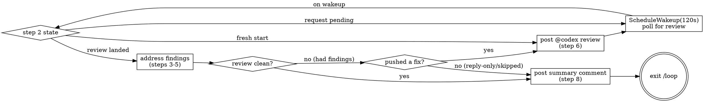

# Cycle Review PR

## Overview

The trigger-driven sibling of [[babysit-pr]]. `babysit-pr` assumes an automated reviewer runs on its own and *polls* for whatever shows up. This skill is for repos where **auto-review is turned off** — nothing reviews the PR until you ask. So each round it **posts `@codex review`** as a top-level PR comment to request a review, **waits** for it to land, then addresses every finding exactly as babysit-pr does (inline review threads, body-only P-badge findings, and top-level bot issue comments), commits + pushes, and **re-triggers** — looping until a freshly-requested review comes back clean.

**The core new state is "review requested, waiting."** Because you triggered the review, you must wait for it before there's anything to address — don't process a stale review from before your last push. Every round keys off `last_request_at` (when you last posted `@codex review`).

**The "resolved" state on a review thread is GraphQL-only.** `gh pr view`, REST `/pulls/{n}/comments`, and the GitHub web search all hide it. Every thread read and write below uses `gh api graphql`. If you find yourself in `gh pr view` output, you're in the wrong API.

**A clean *initial* review can be completely silent.** At least for a PR's first automatic review, some Codex configurations signal "reviewed, no findings" purely by reacting with 👍 on the PR description — no review object, no comment. Step 2 folds this into `LAST_CODEX_AT` so it isn't mistaken for "Codex hasn't answered yet." Whether a *re-triggered* review (this skill's main loop) repeats the reaction or posts a comment instead isn't confirmed — treat the reaction as one more detection surface, not the only one, and watch for the pending-review timeout misfiring if repeat clean passes turn out not to move the timestamp.

**The trigger string.** This skill posts `@codex review` — OpenAI Codex's GitHub command (`@codex` is the app, `review` is the command; a space, **not** a hyphen — GitHub parses `@codex-review` as a nonexistent *user* mention and fires nothing). It's defined once as `TRIGGER` in step 1 and referenced everywhere (the jq filters read it via `env.TRIGGER`). If your Codex app listens for a different mention, change **only that one line** — do not hardcode a string anywhere else.

## How to invoke

```
/loop /cycle-review-pr
```

No interval — let the model self-pace via `ScheduleWakeup` so it can wait for the requested review to land between iterations.

## When NOT to use

- **Auto-review is ON** — if a reviewer already runs automatically, you don't need to trigger it; use [[babysit-pr]] instead (it won't waste review runs on redundant `@codex review` requests).
- Branch has no open PR — skill exits immediately.
- Branch is `main` / `master` — abort (would never have a PR to cycle).
- Uncommitted work in the tree — the skill *will* commit and push; surface the dirty state to the user first.
- Findings require domain judgment the agent can't make (security policy, business logic) — process the mechanical ones, skip these, do not resolve them.
- User wants review run **locally before pushing** at all — that's [[peer-review]] (`/loop /peer-review`), which never touches GitHub.

## One iteration

### 1. Identify the PR

```bash
gh pr view --json number,url,headRefName,baseRefName,headRepositoryOwner,headRepository \
  --jq '{num:.number, url:.url, head:.headRefName, base:.baseRefName,
         owner:.headRepositoryOwner.login, repo:.headRepository.name}'
```

If `head` is `main`/`master`, abort. Cache `{owner, repo, num}` for the rest of the iteration. Set `LAST_PUSH_AT=$(TZ=UTC0 git log -1 --date=iso-strict-local --format=%cd HEAD)` — UTC (`Z`-suffixed), matching every GitHub API timestamp; git's default `%cI` emits your local offset instead, which silently breaks lexical comparisons against API data.

**Define the trigger string once, here, and reference it everywhere via `env.TRIGGER`** (gojq — which `gh --jq` uses — reads exported env vars). This is the single source of truth; change only this line to match your Codex app's mention:

```bash
export TRIGGER="@codex review"   # OpenAI Codex's GitHub command (space, not a hyphen)
```

### 2. Determine review state — trigger, wait, or process?

This step decides which of three paths the iteration takes. Compute these timestamps:

```bash
# When we last requested a review (our own top-level comment containing the trigger)
LAST_REQUEST_AT=$(gh api repos/$OWNER/$REPO/issues/$NUM/comments \
  --jq '[.[] | select(.body | contains(env.TRIGGER)) | .created_at] | max // ""')

# When Codex last did anything: a review submission, a bot relay comment, or a clean-review reaction
LAST_CODEX_REVIEW_AT=$(gh api repos/$OWNER/$REPO/pulls/$NUM/reviews \
  --jq '[.[] | select(.user.login | test("codex|chatgpt|github-actions"; "i")) | .submitted_at] | max // ""')
LAST_CODEX_COMMENT_AT=$(gh api repos/$OWNER/$REPO/issues/$NUM/comments \
  --jq '[.[] | select(.user.type=="Bot" and (.body | contains(env.TRIGGER) | not)) | .created_at] | max // ""')
LAST_CODEX_REACTION_AT=$(gh api repos/$OWNER/$REPO/issues/$NUM/reactions \
  --jq '[.[] | select(.content=="+1" and (.user.login | test("codex|chatgpt"; "i"))) | .created_at] | max // ""')
```

The `test("codex|chatgpt|github-actions"; "i")` match is deliberately broad because Codex may submit as its own login *or* be relayed by `github-actions[bot]`. If your repo has **other** bots that submit PR reviews (e.g. a separate CI linter), that broad match will false-positive — one of them submitting will look like "Codex answered," routing you to Process → find nothing → wrongly declare clean. Narrow the regex to your actual Codex login if so. The reaction check uses the narrower `codex|chatgpt` (no `github-actions`) since the observed pattern is the bot reacting directly — but other bots react too (e.g. `datadog-official[bot]` commonly +1's the same PR for unrelated reasons), so confirm your repo's actual reviewer login if you widen it.

**The reaction timestamp matters most for a clean pass.** When Codex finds nothing, some configurations never create a review object or comment — only a 👍 on the PR description. Without `LAST_CODEX_REACTION_AT`, that clean pass is indistinguishable from Codex never having run, and you'd misroute to Wait until the pending-review timeout fires, or Trigger a redundant re-review.

`LAST_CODEX_AT` = the max of the three Codex timestamps (empty if Codex has never reviewed or reacted). Then branch — **check the empty cases first**, since an empty timestamp string sorts before any real one and would otherwise mis-route:

| Situation | Path |
|---|---|
| `LAST_CODEX_AT` empty **and** `LAST_REQUEST_AT` empty (nobody has reviewed or requested — truly fresh PR) | **Trigger** → jump to step 6 to post the first `@codex review`, then wait (step 7) |
| `LAST_CODEX_AT` empty **and** `LAST_REQUEST_AT` set (we asked, Codex hasn't answered yet) | **Wait** → schedule a poll (step 7), exit iteration |
| `LAST_CODEX_AT` set **and** `LAST_REQUEST_AT` set **and** `LAST_CODEX_AT` < `LAST_REQUEST_AT` (Codex hasn't answered our *latest* request yet) | **Wait** → schedule a poll (step 7), exit iteration — do NOT process a pre-request review |
| `LAST_CODEX_AT` set **and** (`LAST_REQUEST_AT` empty **or** `LAST_CODEX_AT` ≥ `LAST_REQUEST_AT`) (a review exists on the current state — e.g. a manual pre-existing review, or the one we requested) | **Process** → continue to step 3 |

The **Wait** path is what makes this skill different from babysit-pr: you asked for a review, so you must let it arrive before there's anything real to act on. Poll; don't fabricate work from a stale review. **Never route a fresh PR to Process** — with no review yet, step 3 would find nothing and you'd wrongly declare "clean" without ever triggering; the empty-`LAST_CODEX_AT` rows above prevent that.

### 3. Enumerate every finding (GraphQL threads + review bodies + issue comments)

Only reached on the **Process** path — a review has landed since your last request. Gather all three surfaces, exactly as babysit-pr does.

**a. Unresolved inline threads:**

```bash
gh api graphql -f query='
query($owner:String!,$repo:String!,$num:Int!){
  repository(owner:$owner,name:$repo){
    pullRequest(number:$num){
      reviewThreads(first:100){
        nodes{
          id isResolved isOutdated
          comments(first:50){nodes{
            databaseId author{login __typename} body path line diffHunk createdAt
          }}
        }
      }
    }
  }
}' -f owner="$OWNER" -f repo="$REPO" -F num="$NUM"
```

Filter to threads where `isResolved == false && comments.nodes != []`. **Include `isOutdated == true` threads** — often outdated *because* a later commit already addressed them; they still deserve a reply pointing at the fix plus a resolve. Don't drop them silently.

**b. Body-only findings.** Codex often posts substantive P1/P2 findings only in the review *body* with a permalink — no inline thread. Read every review body submitted after `LAST_REQUEST_AT`:

```bash
gh api repos/$OWNER/$REPO/pulls/$NUM/reviews \
  --jq 'map(select(.submitted_at > "'$LAST_REQUEST_AT'")) |
        map({user:.user.login, submitted:.submitted_at, body:.body})'
```

Treat any body containing a `P1/P2/P3 Badge` block (or other severity marker) as actionable even with no thread attached. A truly clean review has an empty body or just a 👍. **Body-only findings can't be resolved via `resolveReviewThread`** — no thread id; after fixing, reference the issue in the commit message and move on.

**c. Top-level bot issue comments.** `github-actions[bot]` (relaying Codex) sometimes posts findings as plain PR conversation comments — in neither query above, and with no Resolve button:

```bash
gh api repos/$OWNER/$REPO/issues/$NUM/comments \
  --jq 'map(select(.user.type=="Bot" and (.is_minimized|not) and .created_at > "'$LAST_REQUEST_AT'"
             and (.body | contains(env.TRIGGER) | not)))
        | map({id:.id, node_id:.node_id, user:.user.login, body:.body})'
```

The `node_id` (e.g. `IC_kwDO…`) is the GraphQL `subjectId` for `minimizeComment` in step 5. Treat any such comment containing a finding as actionable; skip pure status/noise (usage-limit notices, linkbacks, "Claude finished…" summaries) — don't minimize those.

**If all three surfaces are empty → the requested review is CLEAN.** The cycle has converged: post the summary comment (step 8), then exit `/loop` via step 7.

### 4. Plan actions — DO NOT execute yet

Read each thread's file to get current state, then build a working list — one row per finding. For outdated threads, the `line` number is stale; search the current file for what the comment refers to.

| id | kind | action | reply? | resolve/minimize? | reply_text |
|---|---|---|---|---|---|
| `T_abc` | thread | apply fix | **no** | resolve | *(none)* |
| `T_def` | thread | disagree / already handled | yes | resolve | `Not making this change because …` |
| `T_ghi` | thread | clarify | yes | **no** | `Can you clarify …?` |
| `T_jkl` | thread | skip (policy) | **no** | **no** | *(none)* |
| `IC_kwDO…` | issue comment | apply fix | **no** | minimize (`RESOLVED`) | *(none)* |

`kind` distinguishes a review thread (resolvable) from a top-level issue comment (minimizable). A top-level comment has no thread to reply into, so either fix-then-minimize, or skip-and-leave.

Decision rules:

| Situation | Action | Reply? | Resolve? |
|---|---|---|---|
| Suggestion is correct + actionable | Apply the fix | **no** | yes |
| Suggestion is wrong, low-value, or already addressed (including outdated-because-fixed) | Reply with reasoning or pointing at the fix SHA | yes | yes |
| Comment needs clarification (ambiguous, missing context) | Reply asking a specific question | yes | **no** |
| Comment requires architectural/policy/security judgment | Skip entirely | **no** | **no** |

**When a code fix is applied, no reply is needed — just resolve.** Replies are only for threads where no code change is made.

Treat human reviewer threads the same as bot threads, but raise the bar for "apply without asking": apply only if the change is mechanical or clearly correct. When in doubt, reply asking and leave unresolved.

**Do not post any replies or call any mutations during this step.** Execution happens in steps 5–6 after the push, so every reply references a real SHA.

### 5. Apply fixes and push

Apply every code fix from the working list. If there are no code fixes (only reply-only rows), skip the commit but still continue to the reply/resolve step.

When there are fixes to commit, follow the repo's commit conventions — check `CLAUDE.md` / `AGENTS.md` / recent `git log` first. Many repos require ticket-ID suffixes (e.g. `(CON-1234)`); reuse the ID from the PR title or the branch's first commit.

```bash
git add -A && git commit -m "<message following repo convention>" && git push
NEW_SHA=$(git rev-parse --short HEAD)
```

If there were no code fixes, capture HEAD anyway for the reply text:

```bash
NEW_SHA=$(git rev-parse --short HEAD)
```

**Never** force-push, rebase, or amend — review threads anchor to specific commits and these rewrite history.

Now reply and/or resolve — **mandatory, do not skip.** Work through every row.

For rows where `reply? == yes` — post the reply first:

```bash
gh api graphql -f query='
mutation($id:ID!,$body:String!){
  addPullRequestReviewThreadReply(input:{pullRequestReviewThreadId:$id, body:$body}){
    comment{id}
  }
}' -f id="$THREAD_ID" -f body="$REPLY_TEXT"
```

For rows where `resolve? == yes` — resolve the thread:

```bash
gh api graphql -f query='
mutation($id:ID!){
  resolveReviewThread(input:{threadId:$id}){thread{id isResolved}}
}' -f id="$THREAD_ID"
```

For top-level **issue comment** rows you addressed — minimize:

```bash
gh api graphql -f query='
mutation($id:ID!){
  minimizeComment(input:{subjectId:$id, classifier:RESOLVED}){
    minimizedComment{ isMinimized minimizedReason }
  }
}' -f id="$COMMENT_NODE_ID"
```

**Checklist before step 6:**
- [ ] Every thread "apply fix" row: resolved, no reply
- [ ] Every thread "disagree / already handled" row: replied + resolved
- [ ] Every thread "clarify" row: replied, NOT resolved
- [ ] Every "skip" row: no reply, no resolve, no minimize
- [ ] Every issue-comment row you fixed: minimized (`RESOLVED`)

### 6. Re-trigger the review

**Only if you pushed a code change this iteration** (step 5 produced a new commit). A re-review of unchanged code just reproduces the same findings — wasteful and loop-inducing.

```bash
gh api repos/$OWNER/$REPO/issues/$NUM/comments -f body="$TRIGGER"   # $TRIGGER from step 1
LAST_REQUEST_AT=$(TZ=UTC0 git log -1 --date=iso-strict-local --format=%cd HEAD)  # UTC; or capture the comment's created_at directly
```

This is also the path taken on a **fresh start** (step 2 "Trigger" case): no findings to address, no request yet → post `$TRIGGER` to kick off the first review, then wait.

If this iteration made **no code changes** (all findings were reply-only or skipped), do **not** re-trigger — there's nothing new to review. Go to step 7 and exit, surfacing the skipped items to the user.

### 7. Decide whether to continue

Under `/loop` dynamic mode: scheduling a wakeup = continue, omitting it = exit.

| State this iteration | Next |
|---|---|
| **Triggered** a review (fresh start, or re-triggered after a push) | `ScheduleWakeup(120s)` — wait for Codex to answer, then poll |
| **Waiting** (request pending, `LAST_CODEX_AT < LAST_REQUEST_AT`) | `ScheduleWakeup(120s)` — keep polling for the requested review |
| **Processed** a review that came back **clean** (all three surfaces empty) | post the summary comment (step 8) → omit `ScheduleWakeup` → exit `/loop`, report converged |
| **Processed** findings but made **no code changes** (reply-only / skipped) | post the summary comment (step 8) → omit `ScheduleWakeup` → exit `/loop`, surface skipped items to user |

State the phase in `ScheduleWakeup.reason`, e.g. `"waiting for requested codex review on abc1234"`, `"poll 2 for pending review"`.

**How to know the requested review landed.** On each wakeup, recompute `LAST_CODEX_AT` (step 2). Once it exceeds `LAST_REQUEST_AT`, a review arrived on the current state — go process it (step 3). Codex typically answers within 1–5 minutes; the 120s poll stays outside the 5-min prompt-cache TTL only on the first tick, so expect one cache miss per pending review — you're idle anyway.



### 8. Post a summary comment on exit — REQUIRED

Both exit paths (converged clean, or reply-only/skipped) end with a top-level PR comment summarizing the whole cycle, so the review trail is visible on the PR itself — not just in the agent transcript. Do this BEFORE ending the loop; the cycle is not complete without it.

Include:

- **Outcome**: converged clean after N rounds (and the HEAD SHA the clean pass ran on), or exited with items skipped/needing human judgment.
- **Findings addressed**: one line per finding — severity, gist, and the short SHA of the commit that fixed it. Reply-only dispositions (disagreed / already handled) get their one-line reason.
- **Skipped items**, if any, called out prominently as needing human attention.
- **CI status** at last push, and any test caveats (e.g. repos where CI runs no test job — say what was run locally).
- Anything else a human reviewer should know before merging (e.g. a mid-cycle merge from main and what was checked as a result).

```bash
gh api repos/$OWNER/$REPO/issues/$NUM/comments -f body="## Review cycle summary
..."
```

Keep it scannable — headline outcome first, then the per-finding list. This comment is for the humans who review/merge the PR after the loop ends; write it for someone who did not watch the rounds happen.

## Reply phrasing

Keep replies to one or two sentences. Replies are only posted when no code fix was applied.

| Outcome | Template |
|---|---|
| Disagree | `Not making this change because {one-line reason}.` |
| Out of scope | `Out of scope for this PR; tracked separately.` |
| Already handled | `Already handled at {file}:{line}.` |
| Need clarification (do not resolve) | `Can you clarify {specific question}? Want to make sure I understand before changing this.` |

## Anti-loop safeguards

- **Wasted-trigger guard.** Never post `@codex review` when HEAD hasn't changed since your last request — you'll get the same findings back forever. Re-trigger only after a real push (step 6).
- **Same-thread retry cap.** If the same `thread.id` shows up unresolved across three consecutive iterations after you've replied, stop touching it and surface to the user.
- **Reviewer ping-pong.** If a fix generates a *new* comment on the *same line*, address it once. A third comment on that line → stop and escalate.
- **Hard ceiling.** Eight trigger→process cycles without convergence → exit and report. Each cycle spends a real Codex review; don't burn them indefinitely.
- **Pending-review timeout.** If a requested review hasn't landed after ~6 poll ticks (~12 min), the trigger may have failed (wrong mention string, Codex app not installed on the repo) — **or** a clean pass landed as a reaction that isn't feeding `LAST_CODEX_AT` (verify step 2 actually queries `/issues/$NUM/reactions`). Stop and tell the user to check the trigger mention (`$TRIGGER`) and app config.

## Common mistakes

- **Processing a stale review** — the whole point of triggering is that the review must post-date your request. Always gate on `LAST_CODEX_AT ≥ LAST_REQUEST_AT` (step 2) before treating anything as a finding.
- **Re-triggering with no code change** — a fresh `@codex review` on unchanged HEAD reproduces the same findings and loops forever. Only re-trigger after a push (step 6 guard).
- **Skipping the reply/resolve step after a push** — the push is not the end; replies, resolves, and minimizes come after it, before re-triggering.
- **Posting replies during step 4** — step 4 is planning only; replies posted before the push reference a non-existent SHA.
- **Treating "no code changes" as "re-trigger anyway"** — reply-only/skipped iterations produce nothing new to review; exit instead of triggering.
- **Trusting `line` on outdated threads** — the line number is stale; read the current file before deciding whether the concern still applies.
- **Treating a review with no inline threads as automatically clean** — Codex often posts P1/P2 findings only in the review *body* or as a top-level bot comment. Check all three surfaces (step 3) before declaring convergence.
- **Ignoring reactions when computing `LAST_CODEX_AT`** — at least for an initial review, a clean pass may only show up as a 👍 on the PR description, with no review object, thread, or comment. Miss that in step 2 and a completed clean pass looks like "Codex hasn't answered yet," burning poll ticks until the pending-review timeout fires.
- **Wrong trigger string** — if Codex never answers, your mention may not match the app's configured trigger (`@codex review` with a space, **not** `@codex-review` with a hyphen, which GitHub treats as a nonexistent user mention). Fix `TRIGGER` in step 1; don't loop forever waiting.
- **Exiting without the summary comment** — reporting convergence only in the agent transcript leaves no trail on the PR for the humans who merge it. Step 8 is required on both exit paths.
- **Using this when auto-review is ON** — you'd double-review and waste runs; use [[babysit-pr]] instead.
- **Amending or force-pushing** — review threads anchor to commits; rewriting breaks them.
- **Pushing to `main`** — abort if `head == base` or branch is a default branch.
